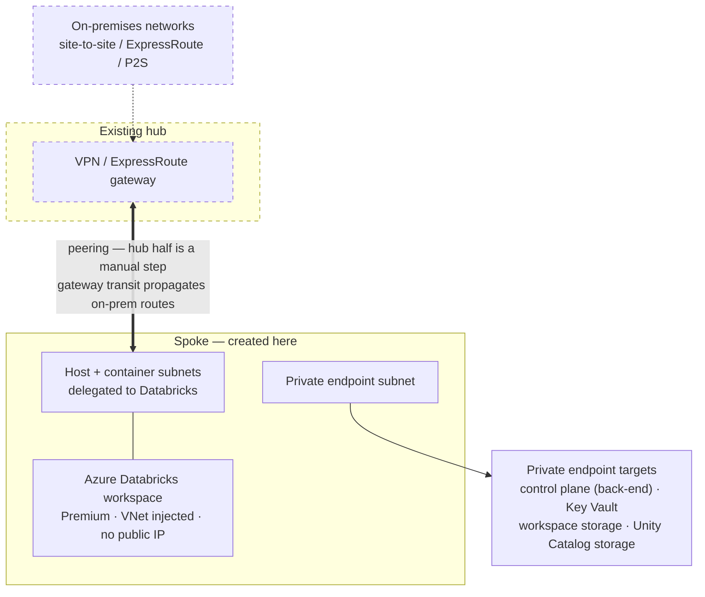
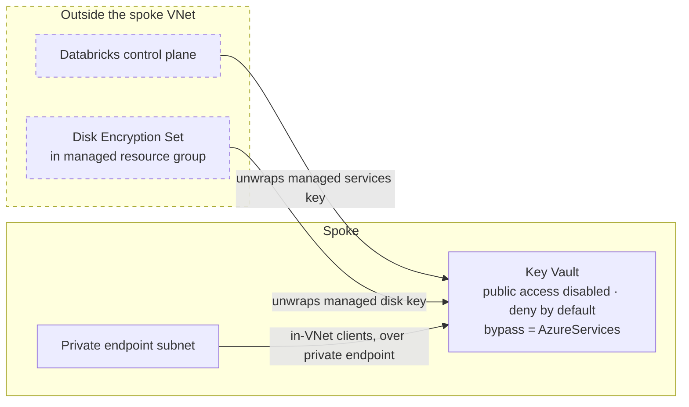

# Security Reference Architecture Template (BYO Hub)

A bring-your-own-hub variant of the Azure Databricks Security Reference Architecture, adapted from
[databricks/terraform-databricks-sra](https://github.com/databricks/terraform-databricks-sra). It deploys a **spoke
workspace into an existing, customer-managed hub** and never creates hub infrastructure. It also assumes the hub has **no
Azure Firewall** and **no BGP** from on-premises. See
[Bring-your-own hub, no Azure Firewall](#bring-your-own-hub-no-azure-firewall).

This is an independent project and is not an official Databricks release; it is not supported by Databricks. See
[LICENSE](LICENSE).

# Getting Started

1. Clone this Repo
2. Install [Terraform](https://developer.hashicorp.com/terraform/downloads)
3. CD into `tf`
4. Copy `template_byo_hub.example.tfvars` to a var file of your own and supply your values, keeping it in the `tf`
   directory. Note that `.gitignore` excludes `*.tfvars` other than the example, so your own file will not be committed:

   ```shell
   cp template_byo_hub.example.tfvars my-spoke.tfvars
   ```

5. Run `terraform init`
6. Run `terraform validate`
7. Run `terraform plan -var-file my-spoke.tfvars`
8. Run `terraform apply -var-file my-spoke.tfvars`
9. **Have the hub owner create the reciprocal hub-to-spoke peering.** Run `terraform output hub_peering_command` and
   send them the result. The spoke peering stays disabled ("Remote sync required") and the spoke has no hub or
   on-premises connectivity until this is done — see [Completing the hub peering](#completing-the-hub-peering).

To validate the deployment, see [Test suite](#test-suite). The mock plan tests need no deployed infrastructure and can be
run at any point, including before the first apply.

To tear it down, use `./destroy.sh` rather than `terraform destroy` — see
[Destroying a deployment](#destroying-a-deployment) for why.

## Note on provider initialization with Azure CLI
If you are using [Azure CLI Authentication](https://registry.terraform.io/providers/databricks/databricks/latest/docs#authenticating-with-azure-cli),
you may encounter an error like the below:

```shell
Error: cannot create mws network connectivity config: io.jsonwebtoken.IncorrectClaimException: Expected iss claim to be: https://sts.windows.net/00000000-0000-0000-0000-000000000000/, but was: https://sts.windows.net/ffffffff-ffff-ffff-ffff-ffffffffffff/
```
This typically happens if you are running this Terraform in a tenant where you are a guest, or if you have multiple
Azure accounts configured. To resolve this error, set the Azure Tenant ID by exporting the `ARM_TENANT_ID` environment
variable:

```shell
export ARM_TENANT_ID="00000000-0000-0000-0000-000000000000"
```

Alternatively, you can set the tenant ID in the databricks provider configurations (see the provider [doc](https://registry.terraform.io/providers/databricks/databricks/latest/docs#special-configurations-for-azure) for more info.)

You may also encounter errors like the below when Terraform begins provisioning workspace resources:

```shell
╷
│ Error: cannot read current user: Unauthorized access to Org: 0000000000000000
│ 
│   with data.databricks_current_user.me,
│    1: data "databricks_current_user" "me" {}
│ 
╵
```

To fix this error, log in to the newly created spoke workspace by clicking on the "Launch Workspace" button in the Azure
portal. This must be done as the user who is running this Terraform, or the user running this Terraform must be granted
workspace admin after the first user launches the workspace.

# Introduction

This repository is a Terraform configuration that deploys an Azure Databricks workspace with a set of platform security
features already wired together, into an existing hub network that it does not manage.

It is one deployment shape among many. Which controls are appropriate for a given environment is a decision for whoever
owns that environment; for Databricks' own guidance, see the
[Azure Databricks security best practices and threat model](https://www.databricks.com/trust/security-features/best-practices)
and the [Security and Trust Center](https://www.databricks.com/trust). The sections below describe what this
configuration does and which variables control it.

# Component Breakdown and Description

This section describes the components included in this configuration. The `.tf` files link to the relevant Azure
Databricks and Terraform documentation; the provider reference is
[here](https://registry.terraform.io/providers/databricks/databricks/latest/docs).

## Infrastructure Deployment

- **VNet injection**: the workspace is deployed into a VNet this configuration creates in the spoke, using
[VNet injection](https://learn.microsoft.com/en-us/azure/databricks/security/network/classic/vnet-inject), with
secure cluster connectivity (no public IP) on the compute subnets.

- **Private endpoints**: [private endpoints](https://learn.microsoft.com/en-us/azure/private-link/private-endpoint-overview)
are created in a dedicated subnet for the Databricks control plane, the workspace storage account, the Unity Catalog
storage account, and — when this configuration creates the vault — Key Vault, together with the matching private DNS
zones.

- **Back-end Private Link**: configured per the
[simplified Private Link](https://learn.microsoft.com/en-us/azure/databricks/security/network/classic/private-link-simplified)
setup, so classic compute reaches the control plane without traversing public IP addresses. Front-end Private Link is a
separate concern: the workspace module has an `is_frontend_private_link_enabled` flag that disables public network access
to the workspace, but it defaults to `false` and is not currently plumbed through to a root-module variable.

- **Unity Catalog**: the workspace is assigned to the existing metastore supplied in `databricks_metastore_id`, and a
catalog with its own storage account and access connector is created for the spoke. See
[Unity Catalog](https://learn.microsoft.com/en-us/azure/databricks/data-governance/unity-catalog/).

- **Serverless egress controls**: the workspace is bound to the existing network connectivity configuration
(`existing_ncc_id`) and account network policy (`existing_network_policy_id`), and NCC private endpoints are created for
the catalog and workspace storage accounts.

## Bring-your-own hub, no Azure Firewall

This project **only** deploys a spoke workspace into an existing, customer-managed hub. It never creates a hub, a hub
("WEBAUTH") workspace, or an Azure Firewall. Hub resources — VNet, VPN gateway, metastore, NCC, and account network
policy — are supplied as `existing_*` inputs and must already exist.

The Key Vault is the exception: it is created **in the spoke** by default, one per deployment. See
[Customer-managed keys](#customer-managed-keys).

It further assumes the hub has **no Azure Firewall** and **no BGP** from the on-premises firewall. Egress filtering is
the responsibility of the existing on-premises perimeter.

The only hub input required for connectivity is the VNet ID:

```hcl
existing_hub_vnet = {
  vnet_id = "/subscriptions/.../virtualNetworks/vnet-external-hub"
}
```

With this configuration:

- **No route table, and no on-premises route list.** On-premises reachability comes from **gateway transit**, which
  propagates routes automatically — see [How on-premises routing works](#how-on-premises-routing-works) below.
- **The spoke uses the hub's gateway.** The spoke-to-hub peering sets `use_remote_gateways = true`, so the spoke
  inherits the hub's gateway. This depends on the hub-side peering setting `allow_gateway_transit` — see
  [Completing the hub peering](#completing-the-hub-peering).

### How on-premises routing works

When the hub peering sets `allow_gateway_transit` and the spoke sets `use_remote_gateways`, Azure **propagates the hub
gateway's learned routes into the spoke VNet as system routes**. That includes on-premises prefixes learned over
site-to-site or ExpressRoute, VNet-to-VNet prefixes, and the point-to-site VPN client address pool. Classic compute in
the injected VNet picks these up with no configuration.

No route table is created, because none is needed: gateway transit already supplies these routes. User-defined routes
are required only to **override** propagated routing — for example to force egress through a network virtual appliance
— which this topology does not do.

Two consequences worth understanding when troubleshooting:

- **A UDR to `VirtualNetworkGateway` does not make a network reachable.** It only directs matching traffic at the
  gateway. If the gateway has no path for that prefix (no site-to-site connection, no local network gateway advertising
  it), packets reach the gateway and are dropped. A route to an unreachable destination is a route to nowhere.
- **Point-to-site only routes the client's VPN-assigned address**, not the LAN behind it. When validating with a P2S
  client, target its address from the gateway's client pool (e.g. `192.168.200.x`), not its local network address
  (e.g. `192.168.2.x`). Reaching the LAN behind a client requires a site-to-site tunnel advertising that range.

To confirm what a spoke VM can actually route to, check its effective routes:

```shell
az network nic show-effective-route-table --name <NIC> --resource-group <RG> -o table
```

Note that Databricks applies a deny assignment to the managed resource group, so this cannot be run against cluster
NICs — use a VM you control in the same VNet, or inspect the propagated routes from the hub side.

### Completing the hub peering

**This deployment is not finished when `terraform apply` succeeds.** One manual step remains, and until it is done the
spoke has no connectivity to the hub or to on-premises.

Azure models VNet peering as **two independent resources, one in each VNet**. Both must exist before the link becomes
`Connected`. This configuration creates only the spoke half, because the hub is customer-managed and every hub resource
is an `existing_*` input that this configuration does not modify.

The hub half **cannot be created in advance**: it must reference the spoke VNet's resource ID, which does not exist
until this configuration has run. It is therefore a post-apply handoff to the hub owner, not a prerequisite.

Until the hub side exists you will see, on the spoke peering:

- Peering state `Initiated` (not `Connected`)
- Sync status **"Remote sync required"**, shown as disabled in the portal
- No traffic between the spoke and the hub, and no on-premises reachability

After `terraform apply`, run `terraform output hub_peering_command` to print a ready-to-run command with your actual
resource names filled in, and send it to whoever administers the hub VNet. It looks like this:

```shell
az network vnet peering create \
  --name from-vnet-external-hub-to-vnet-spoke-peer \
  --resource-group rg-external-hub \
  --vnet-name vnet-external-hub \
  --subscription 00000000-0000-0000-0000-000000000000 \
  --remote-vnet /subscriptions/.../virtualNetworks/vnet-spoke \
  --allow-vnet-access \
  --allow-gateway-transit \
  --allow-forwarded-traffic
```

`terraform output hub_peering_required` gives the same values as structured data if the hub is managed by another
Terraform configuration or a ticketed process.

> **`--allow-gateway-transit` is required, not optional.** It is what permits the spoke's `use_remote_gateways = true`,
> and it is the *only* mechanism giving classic compute a route to on-premises — no UDRs are created. Without it the
> spoke receives no propagated gateway routes and cannot reach on-premises at all, even once the peering shows
> `Connected`.

Verify both sides report `Connected` when done:

```shell
az network vnet peering list --resource-group rg-external-hub --vnet-name vnet-external-hub \
  --query "[].{name:name,state:peeringState,sync:peeringSyncLevel}" -o table
```

If you later change the spoke VNet's address space, the hub peering must be re-synced
(`az network vnet peering sync`) — Azure does not propagate address space changes across an existing peering
automatically.

### Consequence: no internet egress for classic compute

Removing the firewall also removes the `0.0.0.0/0` route that carried outbound internet traffic. Classic compute
subnets fall back to the system default route, and because Azure has retired default outbound access for new
deployments, there may be **no internet egress path at all** — so public package installs (PyPI, CRAN) will fail.
Databricks control plane traffic is unaffected, as it uses back-end Private Link. If workloads need internet access,
provide an explicit path (NAT gateway, or a route to an egress appliance in the hub).

### Limitation: serverless compute cannot reach on-premises

Propagated gateway routes apply only to classic compute in the injected VNet. Serverless compute runs in a
Microsoft-managed VNet, so it does not receive them.

When validating on-premises connectivity from a notebook, **make sure the notebook is attached to a classic cluster.**
Results from a serverless notebook say nothing about this routing path.

Reaching on-premises from serverless requires an NCC private endpoint to an Azure Private Link Service fronting an
internal Standard Load Balancer. That path is **driven by DNS names, not IP ranges**: Databricks requires each
destination to be registered as a resolvable domain name, and
[DNS chasing, wildcard domains, and private-use TLDs such as `.internal` are not supported](https://learn.microsoft.com/en-us/azure/databricks/security/network/serverless-network-security/pl-to-internal-network).
Where on-premises systems are addressed by IP only, this is not currently possible, and it is **not configured by this
deployment**. Keep on-premises workloads on classic compute.

## Customer-managed keys

`cmk_enabled` controls whether the workspace uses customer-managed keys. It defaults to `true`, which configures CMK for
all three scopes Azure Databricks supports — see
[Which CMK scopes this project configures](#which-cmk-scopes-this-project-configures). Set it to `false` to deploy with
platform-managed keys and no Key Vault.

When CMK is enabled, `cmk_source` decides where the keys come from:

| `cmk_source` | Behaviour |
| --- | --- |
| `"create"` (default) | Creates a Key Vault and three keys in the spoke resource group, with a private endpoint and `privatelink.vaultcore.azure.net` zone in the spoke |
| `"existing"` | Uses a vault and keys you already manage, supplied via `existing_cmk_ids` |

### Why the vault is in the spoke

With `cmk_source = "create"`, the vault is created in the spoke resource group, one per deployment, rather than in the
hub. Three things drive that:

- **Region and tenant are constrained by the platform.** Azure Databricks requires the Key Vault and the workspace to be
  in the [same region and the same Microsoft Entra ID tenant](https://learn.microsoft.com/en-us/azure/databricks/security/keys/cmk-managed-disks-azure/);
  they may be in different subscriptions. So a single central vault cannot serve spokes in more than one region, which
  inverts the usual hub-and-spoke intuition — crossing subscriptions is fine, crossing regions is not.
- **Lost keys are unrecoverable**, per the same documentation. A vault per deployment scopes a bad rotation, an
  accidental purge, or an over-broad access policy edit to one environment, and lets each deployment carry its own access
  policies and retention settings.
- **The workspace writes to the vault.** Access policies are granted to the workspace's storage and managed disk
  identities, which only exist *after* the workspace is created. A shared vault would mean every deployment needs write
  permission on it, with N Terraform states mutating one vault's access policies.

If you would rather hold the keys centrally, `cmk_source = "existing"` takes a vault and key IDs you manage yourself via
`existing_cmk_ids`. Note that the workspace module still writes access policies to whichever vault is supplied.

Purge protection is enabled on the created vault and cannot be disabled afterwards.

### Vault network access

The vault gets a private endpoint and a `privatelink.vaultcore.azure.net` zone in the spoke. Public network access is
disabled and the firewall denies by default, with exactly one exception:

- **`bypass = "AzureServices"`** is what actually permits CMK. Neither CMK unwrap call reaches the vault through the
  private endpoint: managed services keys are unwrapped by the Databricks **control plane**, and managed disk keys by the
  **Disk Encryption Set** in the workspace's managed resource group. Both sit outside the spoke VNet. Azure Databricks
  and Azure Disk Storage are both Key Vault trusted services, so the bypass admits them. Remove it and clusters fail to
  start with `KeyVaultAccessForbidden`.

  This is not something an NCC private endpoint rule can replace. Key Vault *is* a supported NCC resource type, so
  serverless compute can reach a vault privately — a Key Vault-backed secret scope, for instance — but NCC private
  endpoints serve **serverless compute egress** (SQL warehouses, jobs, notebooks, Lakeflow pipelines, model serving), and
  neither CMK caller is serverless compute. An NCC private endpoint also lives in the Databricks-managed serverless
  network, not in this spoke, so it is a different endpoint from the one this module creates.

The Disk Encryption Set is why the bypass cannot be traded for an IP allowlist: it has **no published IP range**. The
control plane does publish Control Plane NAT ranges per region, so managed services could in principle be allowlisted —
but that would leave managed disk CMK broken, so the bypass is needed either way. Narrowing the bypass to disks alone
would mean splitting the keys across two vaults; this configuration keeps one vault per deployment instead.

There is **no IP allowlist and no exception for the provisioner**, because the keys are not created over the data plane.
The module creates them as ARM resources (`Microsoft.KeyVault/vaults/keys` via `azapi_resource`) rather than with
`azurerm_key_vault_key`. That matters because, per the Key Vault networking docs, "Key Vault firewall rules only apply to
data plane operations. Control plane operations are not subject to the restrictions specified in firewall rules." So
`terraform apply` provisions the keys through `management.azure.com` and succeeds from anywhere, while
`<vault>.vault.azure.net` stays closed to the internet.

Using `azurerm_key_vault_key` instead would reintroduce a data-plane call and fail with `403` unless the vault's public
endpoint were opened to the machine running Terraform.

One interaction to be aware of if you manage Network Security Perimeters: setting this vault's public network access to
**Secured by Perimeter** — associating it with an NSP in enforced mode — overrides the trusted-services bypass and so
breaks CMK for both key types. The Azure portal surfaces Secured by Perimeter as the recommended setting for resources in
a perimeter, so it is easy to reach for. In NSP transition mode the resource firewall rules above still apply, but they
are already what closes this vault, so a perimeter adds nothing here. Where Azure Databricks does document NSP is for
**workspace storage accounts**, which it onboards to a perimeter allowing the `AzureDatabricksServerless` service tag
(see [firewall support for the workspace storage account](https://learn.microsoft.com/en-us/azure/databricks/security/network/storage/firewall-support));
that service tag does not apply to Key Vault.

### Key versions and rotation

Databricks requires a **specific key version**, not `latest`. The workspace API takes vault URI + key name + key
version, so versionless key IDs are not expressible: the module emits versioned IDs and `existing_cmk_ids` rejects
versionless ones.

The two keys rotate differently:

- **Managed disk** — `managed_disk_cmk_rotation_to_latest_version_enabled` is on, so the Disk Encryption Set picks up new
  key versions by itself. The versioned ID in state records the version at apply time; the DES is free to move past it.
- **Managed services** — no auto-rotation flag exists. Rotating means creating a new key version and running `terraform
  apply`. Keep the old version available for **24 hours** after the update, and do not delete it until the workspace
  update completes.

#### Verifying disk key auto-rotation

Whether a workspace read returns the originally configured key version or the rotated-to version is not documented, so
this is worth checking once per deployment. It matters because if Azure reports the rotated version, Terraform sees drift
and tries to revert it.

1. Record the version currently in use:

   ```bash
   az databricks workspace show \
     --resource-group <rg> --name <workspace> \
     --query "properties.encryption.entities.managedDisk" -o json
   ```

   Note `keyVaultProperties.keyVersion` and confirm `rotationToLatestKeyVersionEnabled` is `true`.

2. Create a new version of the disk key. Rotation is a Key Vault data-plane operation, so run this from a host that
   reaches the vault over its private endpoint, or rotate through the portal:

   ```bash
   az keyvault key rotate --vault-name <vault> --name <key-name>-adb-disk
   ```

3. Re-run the command from step 1. Within a few minutes `keyVersion` should advance to the new version — that confirms
   the DES is following rotations.

4. Run `terraform plan`. **No changes** is the desired outcome. If the plan wants to set `keyVersion` back to the old
   value, add `ignore_changes = [managed_disk_cmk_key_vault_key_id]` to the workspace resource rather than disabling
   auto-rotation.

5. Confirm compute still works by starting a cluster. A failure here points at Key Vault permissions for the Disk
   Encryption Set rather than at rotation.

Do not delete the old key version until after step 5 passes.

### Which CMK scopes this project configures

Azure Databricks has [three customer-managed key features](https://learn.microsoft.com/en-us/azure/databricks/security/keys/customer-managed-keys)
for different types of data. When `cmk_enabled = true`, this configuration sets up all three, plus infrastructure
encryption:

| Scope | Where the data lives | What Azure Databricks documents it covering |
| --- | --- | --- |
| [Managed services](https://learn.microsoft.com/en-us/azure/databricks/security/keys/cmk-managed-services-azure/) | Databricks control plane | Notebook source and metadata, secrets, Databricks SQL queries and query history, PATs used for Git integration, AI/BI dashboards, Genie agents |
| [DBFS root](https://learn.microsoft.com/en-us/azure/databricks/security/keys/customer-managed-keys-dbfs/) | Workspace storage account, in your subscription | Job results, Databricks SQL results, MLflow models, notebook revisions and other workspace system data, FileStore, DBFS root data |
| [Managed disks](https://learn.microsoft.com/en-us/azure/databricks/security/keys/cmk-managed-disks-azure/) | Data disks on classic compute VMs, in your subscription | Temporary disk storage for classic compute. Does not apply to OS disks, or to serverless compute |

A separate key is created per scope, so each can be rotated or revoked independently.

`cmk_enabled` is a **single switch covering all three scopes** — there is no per-scope toggle. Setting it to `false`
creates no Key Vault and leaves the workspace on platform-managed keys; setting it to `true` also sets
`infrastructure_encryption_enabled` on the workspace, which is Azure Databricks'
[double encryption for DBFS root](https://learn.microsoft.com/en-us/azure/databricks/security/keys/double-encryption).
`cmk_source` then selects where the keys come from, per the table above.

Two documented platform behaviours are worth knowing before enabling:

- **Managed disk CMK cannot be turned off once enabled** for a workspace, per the
  [managed disk CMK documentation](https://learn.microsoft.com/en-us/azure/databricks/security/keys/cmk-managed-disks-azure/).
  Because `cmk_enabled` covers all three scopes together, flipping it back to `false` after an apply will not undo this
  scope.
- **Lost keys are unrecoverable.** If a key is lost or revoked and cannot be restored, the workspace's compute resources
  stop working.

Some properties of managed disks are independent of CMK and hold either way: the disks are ephemeral and destroyed when
the compute terminates, they are encrypted by default with a Microsoft-managed key, public network access to Azure data
disks [is disabled for Azure Databricks workspaces](https://learn.microsoft.com/en-us/azure/databricks/security/keys/),
and the managed resource group carries
[deny assignments](https://learn.microsoft.com/en-us/azure/role-based-access-control/deny-assignments).

For Databricks' own guidance on which of these controls to apply to a given environment, see the public
[Azure Databricks security best practices and threat model](https://www.databricks.com/trust/security-features/best-practices).

## Workspace default storage

Every Azure Databricks workspace has a
[workspace storage account](https://learn.microsoft.com/en-us/azure/databricks/security/network/storage/firewall-support)
in its managed resource group. It holds workspace system data, MLflow artifacts, query results, and the DBFS root. The
account is **mandatory and cannot be removed**, so securing it is a separate concern from whether DBFS itself is used.

The `secure_workspace_default_storage` flag on the workspace module controls this. It defaults to `true`, which sets
`default_storage_firewall_enabled` on the workspace — blocking public network access to that account — and provisions the
private endpoints, NCC private endpoints, and dedicated access connector that
[firewall support requires](https://learn.microsoft.com/en-us/azure/databricks/security/network/storage/firewall-support).
The remaining prerequisites (VNet injection, secure cluster connectivity, Premium plan, a separate private-endpoint
subnet) are satisfied by the rest of this configuration.

Two things about the timing are worth knowing, since they affect whether it is cheaper to enable this on the first apply
or later:

- Azure Databricks documents that enabling firewall support via the Azure CLI or PowerShell **deletes the existing access
  connector in the managed resource group**, that this cannot be undone, and that Unity Catalog external locations bound
  to that connector lose access until they are remapped. Enabling it from the first apply means there are no external
  locations to remap yet.
- The same page notes that you may be prompted to stop all compute in the workspace before creating the private
  endpoints.

Note that this configuration does not manage the DBFS root and mounts setting, which is separate from the storage
firewall. Azure Databricks documents that
[DBFS root and DBFS mounts are deprecated and that new accounts are provisioned without access to these features](https://learn.microsoft.com/en-us/azure/databricks/dbfs/),
so on a new account there is nothing to disable. On an older account, the setting is a workspace or account admin
setting rather than a Terraform input.

### Why there are two access connectors

- `id-databricks-uc-<suffix>` — used by Unity Catalog to reach the catalog's storage account.
- `id-databricks-ws-<suffix>` — used by the control plane and serverless plane to reach the **workspace default
  storage** account. Required when the storage firewall is enabled.

Each identity is granted roles scoped only to its own storage account, so a Unity Catalog credential cannot reach
workspace storage and vice versa.

Both connectors are created in the **spoke resource group, not the workspace managed resource group**. Azure Databricks
requires this: its firewall-support documentation states that you cannot use the access connector in the managed resource
group, and that enabling firewall support deletes the one that lives there.

## Post Workspace Deployment

Some settings are workspace or account admin settings rather than Terraform inputs, so they are not configured here:

- **Workspace admin settings**: A number of security-relevant settings live in the
[workspace admin settings](https://learn.microsoft.com/en-us/azure/databricks/admin/workspace-settings/) and the
[account console](https://learn.microsoft.com/en-us/azure/databricks/admin/), and are applied after deployment.

- **Cluster and pool tags**: [Cluster and pool tags](https://learn.microsoft.com/en-us/azure/databricks/admin/account-settings/usage-detail-tags)
attribute Databricks usage to a business unit or team and propagate to detailed DBU usage reports for cost analysis.

## Adding additional spokes

This configuration deploys a single spoke per Terraform state. There is no `modules/spoke` and no `spoke_config`
variable.

To deploy additional spokes into the same existing hub, use one of the following:

1. **Separate state per spoke (recommended).** Run this configuration once per spoke with its own var file, backend key,
   and `resource_suffix`. Each spoke peers to the same `existing_hub_vnet` and binds to the same `existing_ncc_id` and
   `existing_network_policy_id`. Give each spoke a non-overlapping `workspace_vnet.cidr`.

2. **Terraform workspaces.** One `terraform workspace` per spoke against the same configuration, again varying
   `resource_suffix` and `workspace_vnet.cidr`.

Each spoke gets its on-premises routes from gateway transit via its own peering, so there is nothing per-spoke to
configure for routing beyond the peering itself (including the hub-side half — see
[Completing the hub peering](#completing-the-hub-peering)).

# Destroying a deployment

Use the wrapper script rather than calling `terraform destroy` directly:

```shell
cd tf
./destroy.sh -var-file my-spoke.tfvars
```

A plain `terraform destroy` **fails**, and it fails partway through, leaving the deployment half torn down. Two things
need handling that Terraform cannot do on its own.

## The CMK keys cannot be deleted by Terraform

ARM has no DELETE verb for `Microsoft.KeyVault/vaults/keys`:

```
RESPONSE 405: DeleteNotSupported
"The resource type does not support delete operation."
```

Deleting a key is only ever a Key Vault **data-plane** operation. That asymmetry is deliberate on the create side — it is
what lets `terraform apply` create the keys through a firewalled vault with no IP allowlist, as described under
[Vault network access](#vault-network-access) — but it leaves destroy with no path, because `azapi_resource` has no
option to skip the delete, and the keys depend on the vault transitively, so destroy always attempts them *first*.

Deleting the vault removes its keys anyway, so the script drops them from state and lets the vault deletion do the work.
Nothing is orphaned. It backs up state first, since the edit is hard to undo.

Note that **purge protection is enabled and cannot be disabled**, so the vault and its keys stay soft-deleted for
`soft_delete_retention_days` and the name stays reserved. That is expected, not a failure. Vault names carry a random
suffix, so a later deployment will not collide with the soft-deleted one. To reclaim the name sooner you must purge it
explicitly (`az keyvault purge --name <vault>`), which is irreversible.

## The hub half of the peering is left behind

The same split that requires a manual step after apply applies in reverse. This configuration manages only the spoke half
of the peering, so destroying the spoke leaves the hub half pointing at a VNet that no longer exists, where it shows as
`Disconnected`.

On success the script prints a ready-to-run `az network vnet peering delete` command with your values filled in — the
mirror image of `hub_peering_command` — to send to whoever administers the hub VNet. This cannot be a Terraform output,
because outputs are read from state and the state is empty once the destroy finishes; the values are captured before the
destroy and printed after.

Leaving the stale peering in place is not harmful, but it blocks re-peering a new spoke that reuses the same VNet name,
and a stale peering must be **deleted** rather than re-synced — `az network vnet peering sync` fixes
`RemoteNotInSync`, not a peering whose remote VNet is gone.

The command is only printed when the destroy succeeds. After a partial destroy the spoke VNet may still exist, and
deleting a live peering would be wrong.

# Test suite

Tests live in `tf/tests` and use Terraform's native test framework, so they are run with `terraform test` from the `tf`
directory. That directory is also `terraform test`'s default test directory, so no `-test-directory` flag is needed.

There are two suites plus one standalone check, and they have very different prerequisites:

| Suite | File | Cost / prerequisites |
| --- | --- | --- |
| Mock plan tests | `tests/mock_plan.tftest.hcl` | No deployed infrastructure, creates nothing |
| Integration tests | `tests/integration.tftest.hcl` | Requires an applied deployment; creates a cluster and runs jobs |
| Private endpoint ordering | `tests/check_private_endpoint_ordering.sh` | Requires an applied deployment; read-only |

## Mock plan tests

Ten `command = plan` runs covering the topology and security defaults: the no-firewall gateway-transit path, CMK enabled
and disabled, the spoke Key Vault's network posture, BYO network, BYO resource group, name overrides, and subnet sizing.
The `azurerm` and `databricks` providers are mocked, so nothing is created and no deployment has to exist.

```shell
cd tf
terraform init
terraform test -filter=tests/mock_plan.tftest.hcl
```

Two prerequisites are easy to miss, because "mocked providers" suggests there are none:

- **You still need to be logged in to Azure** (`az login`). The `azuread` provider is *not* mocked — the Key Vault module
  looks up the Databricks service principal through it — so it authenticates for real.
- **You still need values for the required root variables** (`subscription_id`, `location`, `resource_suffix`,
  `databricks_account_id`, `databricks_metastore_id`, `existing_hub_vnet`, `existing_ncc_id`,
  `existing_network_policy_id`). A `terraform.tfvars` in `tf` is picked up automatically; otherwise pass
  `-var-file my-spoke.tfvars`. Without them every run fails with "required variable ... with no set value" rather than a
  test assertion failure.

Note that `terraform test` does **not** read `*.auto.tfvars` the way `plan` and `apply` do, and `-filter` takes test file
paths, not individual run block names.

## Integration tests

These run against a **deployed** workspace: they use `command = apply`, read the real state, and create real resources.
Run them only after a successful `terraform apply`.

```shell
cd tf
terraform test -filter=tests/integration.tftest.hcl
```

The run blocks execute in dependency order:

1. `test_initializer` — reads outputs from the local state (`terraform.tfstate`) to get the workspace URL, Azure resource
   ID, and catalog name. Everything downstream depends on this, so a failure here usually means the state is missing
   outputs and the root needs applying first.
2. `cmk_configured` — reads the deployed workspace over ARM and asserts all three CMK scopes (managed services, managed
   disk, DBFS root) report `keySource = "Microsoft.Keyvault"` rather than the platform-managed `Default`, that all three
   resolve to one vault, that managed disk rotation-to-latest is on, and that infrastructure encryption is enabled. This
   asserts *configuration*, not use — see [Customer-managed keys](#customer-managed-keys).
3. `classic_cluster_spoke` — creates a small autoscaling classic cluster. A `KeyVaultAccessForbidden` failure here is the
   signal that a configured CMK has become unreachable.
4. `bundle_deploy` and the `spark_basic` / `ml_workflow_*` / `lakebase_connectivity` runs — deploy a Databricks Asset
   Bundle and run its jobs, covering Unity Catalog reads and writes, model registration, and Lakebase connectivity.

See [`tf/tests/README.md`](tf/tests/README.md) for the helper modules and the bundle's contents.

> **If front-end Private Link is enabled, these tests must run from inside the network.** The workspace module's
> `is_frontend_private_link_enabled` flag controls this and defaults to `false`, so on a default deployment the workspace
> still accepts public traffic and the tests can run from anywhere. Once it is set to `true`, the workspace rejects
> traffic arriving over its public IP, and public DNS resolves the workspace hostname to exactly that address. Run from a
> host that resolves the workspace through the `privatelink.azuredatabricks.net` private DNS zone — a VM in the spoke or a
> peered VNet, a P2S/S2S VPN client configured to use that zone, or a self-hosted CI runner in the VNet.
>
> Running from outside does not fail cleanly: `terraform test` **hangs** on the `databricks_*` data sources in
> `bundle_deploy` with an established but unanswered TLS connection, rather than reporting a DNS or authorization error.
> The earlier `cmk_configured` run is not affected and will pass, because it talks to `management.azure.com` rather than
> to the workspace — so a run that passes CMK and then stalls is the signature of this problem, not of a slow cluster.

## Private endpoint ordering check

```shell
cd tf
tests/check_private_endpoint_ordering.sh
```

Asserts that the workspace's back-end private endpoint is ordered after every resource that puts the workspace into the
`Updating` state — the two Key Vault access policies and the DBFS root CMK. None of them is a data dependency of the
private endpoint, so only an explicit `depends_on` keeps them apart, and Azure rejects the endpoint with
`InvalidWorkspaceProvisioningState` when they overlap.

This is a shell script rather than a `terraform test` assertion because assertions can only read *values*, and
`depends_on` is not a value — it appears only in the plan's configuration JSON, which is what the script inspects. It is
worth running after any change to `modules/workspace`, since the underlying failure is a race: an apply can pass by luck
even with the ordering missing.

The script runs `terraform plan`, so it needs the same credentials and variables as a normal plan, and it will fail on a
held state lock if an apply or destroy is in flight.

## Running everything

```shell
cd tf
terraform test
```

This picks up both test files, so the integration prerequisites above apply. Run `terraform init` again after adding or
renaming a `.tftest.hcl` file that references a new module directory — otherwise Terraform reports a confusing
"Provider type mismatch" error pointing at an unrelated test file.

# Outside the scope of this configuration

Several platform capabilities are not configured here, either because they are account-level or workspace-admin settings
rather than Terraform inputs, or because they depend on an organization's own identity provider and processes. If you are
assembling a full deployment, these are the areas this configuration leaves to you:

- **Identity**: [authentication and access control](https://learn.microsoft.com/en-us/azure/databricks/security/auth-authz/),
  including SSO, and [SCIM provisioning](https://learn.microsoft.com/en-us/azure/databricks/admin/users-groups/scim/) to
  sync users and groups from your identity provider.
- **Workspace and account admin settings**: see [Manage your workspace](https://learn.microsoft.com/en-us/azure/databricks/admin/workspace-settings/).
  This configuration exposes the `workspace_security_compliance` variable for the
  [compliance security profile, enhanced security monitoring, and automatic cluster update](https://learn.microsoft.com/en-us/azure/databricks/security/privacy/security-profile),
  but the remaining admin settings are applied post-deployment.
- **Workspace and data isolation**: how workloads are split across workspaces and how Unity Catalog privileges are
  granted. This configuration creates one workspace and one catalog; see
  [Data governance with Unity Catalog](https://learn.microsoft.com/en-us/azure/databricks/data-governance/unity-catalog/).
- **Disaster recovery**: no standby workspace or cross-region replication is configured. See
  [Disaster recovery](https://learn.microsoft.com/en-us/azure/databricks/admin/disaster-recovery).
- **CI/CD and source control**: see [CI/CD on Databricks](https://learn.microsoft.com/en-us/azure/databricks/dev-tools/ci-cd/).
- **Egress filtering**: this topology assumes the existing on-premises perimeter handles it — see
  [Bring-your-own hub, no Azure Firewall](#bring-your-own-hub-no-azure-firewall).

# Network Diagram

Dashed boxes are supplied as `existing_*` inputs; solid boxes are created by this configuration. Note the absence of an
Azure Firewall and of any route table — see
[Bring-your-own hub, no Azure Firewall](#bring-your-own-hub-no-azure-firewall).

## Connectivity



Serverless compute does not appear here because it runs outside this VNet and receives none of these routes — see
[Limitation: serverless compute cannot reach on-premises](#limitation-serverless-compute-cannot-reach-on-premises). The
hub half of the peering does not exist when `terraform apply` finishes; see
[Completing the hub peering](#completing-the-hub-peering).

## CMK trust path

Both unwrap callers sit **outside** the spoke VNet, which is why the vault keeps a trusted-services bypass rather than
relying solely on its private endpoint — see [Vault network access](#vault-network-access).


