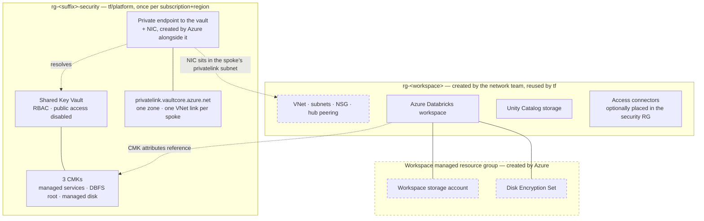
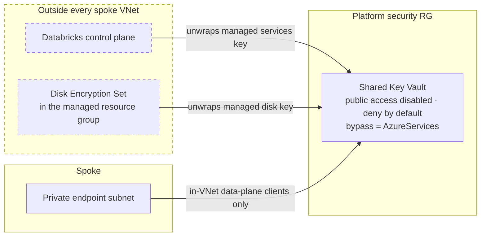

# Security Reference Architecture Template (BYO Hub)

A bring-your-own-hub variant of the Azure Databricks Security Reference Architecture, adapted from
[databricks/terraform-databricks-sra](https://github.com/databricks/terraform-databricks-sra). It deploys a **spoke
workspace into an existing, customer-managed hub** and never creates hub infrastructure. It also assumes the hub has **no
Azure Firewall** and **no BGP** from on-premises. See
[Bring-your-own hub, no Azure Firewall](#bring-your-own-hub-no-azure-firewall).

This is an independent project and is not an official Databricks release; it is not supported by Databricks. See
[LICENSE](LICENSE).

# Getting Started

## Deployment order

This repository has **two configurations**, and they sit inside a three-step sequence:

| | Step | Who | Owns |
| --- | --- | --- | --- |
| 0 | Spoke resource group, VNet, subnets, and hub peering | the network team, outside this repo | `rg-<workspace>` and the VNet in it |
| 1 | [`tf/platform`](tf/platform) | once per subscription, per region | the shared Key Vault, the three CMKs, and the vault's private endpoint + DNS zone |
| 2 | `tf` | once per workspace | the workspace, catalog, and their private endpoints |

Step 0 comes first because **peering a spoke VNet to the hub requires permissions on the hub network that the Databricks
provisioner often does not hold** — see
[Peering permissions and how to skip the peering](#peering-permissions-and-how-to-skip-the-peering), which also covers
building the VNet here while still leaving the peering to the network team.

The network team creates the VNet, and it needs a resource group to live in — so that resource group becomes the spoke's
resource group, reused by step 2 via `create_workspace_resource_group = false` and `existing_resource_group_name`. Step 2
consumes the VNet via `create_workspace_vnet = false` and `existing_workspace_vnet`.

That ordering is also what lets step 1 own the vault's private endpoint: the endpoint needs a subnet, and by step 1 the
privatelink subnet already exists. See [Private access to the vault](#private-access-to-the-vault).

Steps 1 and 2 have separate states, because the vault outlives every workspace bound to it. See
[Why the vault is not in the spoke](#why-the-vault-is-not-in-the-spoke).

Both configurations can create their own resource group and network instead, which is convenient for a self-contained
test deployment: leave `create_workspace_resource_group` and `create_workspace_vnet` at their defaults. In that case the
spoke VNet does not exist when step 1 runs, so set `create_key_vault_private_endpoint = false` in the platform layer —
CMK does not depend on it.

## 1. The platform layer

Skip this only if you are deploying with `cmk_enabled = false`. Full detail, including required permissions, is in
[`tf/platform/README.md`](tf/platform/README.md).

```shell
cd tf/platform
cp template_platform.example.tfvars my-platform.tfvars    # then fill it in
terraform init
terraform apply -var-file my-platform.tfvars

terraform output -raw spoke_tfvars_snippet                 # keep this for step 2
```

## 2. The spoke workspace

1. `cd tf`
2. Copy `template_byo_hub.example.tfvars` to a var file of your own, keeping it in the `tf` directory. `.gitignore`
   excludes `*.tfvars` other than the example, so your own file will not be committed:

   ```shell
   cp template_byo_hub.example.tfvars my-spoke.tfvars
   ```

3. Paste the `spoke_tfvars_snippet` from step 1 into it, replacing the placeholder `platform_cmk` block. **`location` must
   match the platform layer's location** — a vault cannot serve a workspace in another region, and nothing in Terraform
   catches a mismatch before Azure rejects the workspace create.
4. Point it at the resource group and VNet from step 0: set `create_workspace_resource_group = false` with
   `existing_resource_group_name`, and `create_workspace_vnet = false` with `existing_workspace_vnet`. Leave both at their
   defaults only for a self-contained test deployment that creates its own network.
5. Run `terraform init`
6. Run `terraform validate`
7. Run `terraform plan -var-file my-spoke.tfvars`
8. Run `terraform apply -var-file my-spoke.tfvars`
9. **Only if this configuration created the VNet** (`create_workspace_vnet = true`): have the hub owner create the
   reciprocal hub-to-spoke peering. Run `terraform output hub_peering_command` and send them the result. The spoke peering
   stays disabled ("Remote sync required") and the spoke has no hub or on-premises connectivity until this is done — see
   [Completing the hub peering](#completing-the-hub-peering). When the network team built the VNet in step 0, both halves
   of the peering already exist and there is nothing to do here.

   If the apply itself failed on the peering with `LinkedAuthorizationFailed`, the provisioner lacks `peer/action` on the
   hub network — set `create_hub_peering = false` and hand off both halves. See
   [Peering permissions and how to skip the peering](#peering-permissions-and-how-to-skip-the-peering).

Repeat step 2 per workspace, each with its own var file, backend key, and `resource_suffix` — see
[Adding additional spokes](#adding-additional-spokes). A hyphen in `resource_suffix` (e.g. `dbx-prod`) is fine — the
Unity Catalog storage account name is sanitized to the `[a-z0-9]` set Azure requires, and every other resource type
accepts the hyphen.

To validate the deployment, see [Test suite](#test-suite). The mock plan tests in both configurations need no deployed
infrastructure and can be run at any point, including before the first apply — the spoke suite works against the example
var file, so it runs on a fresh clone with no configuration.

To tear down a workspace, run `terraform destroy`, or `./destroy.sh` to also print the hub-side peering cleanup — see
[Destroying a deployment](#destroying-a-deployment). Either way the shared vault is left intact.

## Note on provider initialization with Azure CLI
If you are using [Azure CLI Authentication](https://registry.terraform.io/providers/databricks/databricks/latest/docs#authenticating-with-azure-cli),
you may encounter an error like the below:

```shell
Error: cannot create mws network connectivity config: io.jsonwebtoken.IncorrectClaimException: Expected iss claim to be: https://sts.windows.net/00000000-0000-0000-0000-000000000000/, but was: https://sts.windows.net/ffffffff-ffff-ffff-ffff-ffffffffffff/
```
This typically happens if you are running this Terraform in a tenant where you are a guest, or if you have multiple
Azure accounts configured. To resolve this error, set the Azure Tenant ID by exporting the `ARM_TENANT_ID` environment
variable:

```shell
export ARM_TENANT_ID="00000000-0000-0000-0000-000000000000"
```

Alternatively, you can set the tenant ID in the databricks provider configurations (see the provider [doc](https://registry.terraform.io/providers/databricks/databricks/latest/docs#special-configurations-for-azure) for more info.)

You may also encounter errors like the below when Terraform begins provisioning workspace resources:

```shell
╷
│ Error: cannot read current user: Unauthorized access to Org: 0000000000000000
│ 
│   with data.databricks_current_user.me,
│    1: data "databricks_current_user" "me" {}
│ 
╵
```

To fix this error, log in to the newly created spoke workspace by clicking on the "Launch Workspace" button in the Azure
portal. This must be done as the user who is running this Terraform, or the user running this Terraform must be granted
workspace admin after the first user launches the workspace.

# Introduction

This repository is a Terraform configuration that deploys an Azure Databricks workspace with a set of platform security
features already wired together, into an existing hub network that it does not manage.

It is one deployment shape among many. Which controls are appropriate for a given environment is a decision for whoever
owns that environment; for Databricks' own guidance, see the
[Azure Databricks security best practices and threat model](https://www.databricks.com/trust/security-features/best-practices)
and the [Security and Trust Center](https://www.databricks.com/trust). The sections below describe what this
configuration does and which variables control it.

# Component Breakdown and Description

This section describes the components included in this configuration. The `.tf` files link to the relevant Azure
Databricks and Terraform documentation; the provider reference is
[here](https://registry.terraform.io/providers/databricks/databricks/latest/docs).

## Infrastructure Deployment

- **VNet injection**: the workspace is deployed into a spoke VNet using
[VNet injection](https://learn.microsoft.com/en-us/azure/databricks/security/network/classic/vnet-inject), with
secure cluster connectivity (no public IP) on the compute subnets. The VNet is either created by this configuration or
supplied as an existing one via `create_workspace_vnet = false` — see [Deployment order](#deployment-order).

- **Private endpoints**: [private endpoints](https://learn.microsoft.com/en-us/azure/private-link/private-endpoint-overview)
are created in a dedicated subnet for the Databricks control plane, the workspace storage account, and the Unity Catalog
storage account, together with the matching private DNS zones. The shared Key Vault's endpoint and zone are created by the
platform layer instead — see [Private access to the vault](#private-access-to-the-vault).

- **Back-end Private Link**: configured per the
[simplified Private Link](https://learn.microsoft.com/en-us/azure/databricks/security/network/classic/private-link-simplified)
setup, so classic compute reaches the control plane without traversing public IP addresses. Front-end Private Link is a
separate concern: the workspace module has an `is_frontend_private_link_enabled` flag that disables public network access
to the workspace, but it defaults to `false` and is not currently plumbed through to a root-module variable.

- **Unity Catalog**: the workspace is assigned to the existing metastore supplied in `databricks_metastore_id`, and a
catalog with its own storage account and access connector is created for the spoke. See
[Unity Catalog](https://learn.microsoft.com/en-us/azure/databricks/data-governance/unity-catalog/).

- **Serverless egress controls**: the workspace is bound to the existing network connectivity configuration
(`existing_ncc_id`) and account network policy (`existing_network_policy_id`), and NCC private endpoints are created for
the catalog and workspace storage accounts.

## Bring-your-own hub, no Azure Firewall

This project **only** deploys a spoke workspace into an existing, customer-managed hub. It never creates a hub, a hub
("WEBAUTH") workspace, or an Azure Firewall. Hub resources — VNet, VPN gateway, metastore, NCC, and account network
policy — are supplied as `existing_*` inputs and must already exist.

The Key Vault is the exception: it is created **in the spoke** by default, one per deployment. See
[Customer-managed keys](#customer-managed-keys).

It further assumes the hub has **no Azure Firewall** and **no BGP** from the on-premises firewall. Egress filtering is
the responsibility of the existing on-premises perimeter.

The only hub input required for connectivity is the VNet ID:

```hcl
existing_hub_vnet = {
  vnet_id = "/subscriptions/.../virtualNetworks/vnet-external-hub"
}
```

With this configuration:

- **No route table, and no on-premises route list.** On-premises reachability comes from **gateway transit**, which
  propagates routes automatically — see [How on-premises routing works](#how-on-premises-routing-works) below.
- **The spoke uses the hub's gateway.** The spoke-to-hub peering sets `use_remote_gateways = true`, so the spoke
  inherits the hub's gateway. This depends on the hub-side peering setting `allow_gateway_transit` — see
  [Completing the hub peering](#completing-the-hub-peering).

### How on-premises routing works

When the hub peering sets `allow_gateway_transit` and the spoke sets `use_remote_gateways`, Azure **propagates the hub
gateway's learned routes into the spoke VNet as system routes**. That includes on-premises prefixes learned over
site-to-site or ExpressRoute, VNet-to-VNet prefixes, and the point-to-site VPN client address pool. Classic compute in
the injected VNet picks these up with no configuration.

No route table is created, because none is needed: gateway transit already supplies these routes. User-defined routes
are required only to **override** propagated routing — for example to force egress through a network virtual appliance
— which this topology does not do.

Two consequences worth understanding when troubleshooting:

- **A UDR to `VirtualNetworkGateway` does not make a network reachable.** It only directs matching traffic at the
  gateway. If the gateway has no path for that prefix (no site-to-site connection, no local network gateway advertising
  it), packets reach the gateway and are dropped. A route to an unreachable destination is a route to nowhere.
- **Point-to-site only routes the client's VPN-assigned address**, not the LAN behind it. When validating with a P2S
  client, target its address from the gateway's client pool (e.g. `192.168.200.x`), not its local network address
  (e.g. `192.168.2.x`). Reaching the LAN behind a client requires a site-to-site tunnel advertising that range.

To confirm what a spoke VM can actually route to, check its effective routes:

```shell
az network nic show-effective-route-table --name <NIC> --resource-group <RG> -o table
```

Note that Databricks applies a deny assignment to the managed resource group, so this cannot be run against cluster
NICs — use a VM you control in the same VNet, or inspect the propagated routes from the hub side.

### Completing the hub peering

**This deployment is not finished when `terraform apply` succeeds.** One manual step remains, and until it is done the
spoke has no connectivity to the hub or to on-premises.

Azure models VNet peering as **two independent resources, one in each VNet**. Both must exist before the link becomes
`Connected`. This configuration creates only the spoke half, because the hub is customer-managed and every hub resource
is an `existing_*` input that this configuration does not modify.

The hub half **cannot be created in advance**: it must reference the spoke VNet's resource ID, which does not exist
until this configuration has run. It is therefore a post-apply handoff to the hub owner, not a prerequisite.

Until the hub side exists you will see, on the spoke peering:

- Peering state `Initiated` (not `Connected`)
- Sync status **"Remote sync required"**, shown as disabled in the portal
- No traffic between the spoke and the hub, and no on-premises reachability

After `terraform apply`, run `terraform output hub_peering_command` to print a ready-to-run command with your actual
resource names filled in, and send it to whoever administers the hub VNet. It looks like this:

```shell
az network vnet peering create \
  --name from-vnet-external-hub-to-vnet-spoke-peer \
  --resource-group rg-external-hub \
  --vnet-name vnet-external-hub \
  --subscription 00000000-0000-0000-0000-000000000000 \
  --remote-vnet /subscriptions/.../virtualNetworks/vnet-spoke \
  --allow-vnet-access \
  --allow-gateway-transit \
  --allow-forwarded-traffic
```

`terraform output hub_peering_required` gives the same values as structured data if the hub is managed by another
Terraform configuration or a ticketed process.

> **`--allow-gateway-transit` is required, not optional.** It is what permits the spoke's `use_remote_gateways = true`,
> and it is the *only* mechanism giving classic compute a route to on-premises — no UDRs are created. Without it the
> spoke receives no propagated gateway routes and cannot reach on-premises at all, even once the peering shows
> `Connected`.

Verify both sides report `Connected` when done:

```shell
az network vnet peering list --resource-group rg-external-hub --vnet-name vnet-external-hub \
  --query "[].{name:name,state:peeringState,sync:peeringSyncLevel}" -o table
```

If you later change the spoke VNet's address space, the hub peering must be re-synced
(`az network vnet peering sync`) — Azure does not propagate address space changes across an existing peering
automatically.

### Peering permissions and how to skip the peering

Creating the spoke half of the peering **requires permissions on the hub network**, not just on the spoke. ARM authorizes a
peering against the linked virtual network, so it needs `Microsoft.Network/virtualNetworks/peer/action` on the hub VNet, and
without it the apply fails with `LinkedAuthorizationFailed` — even though the only resource being created lives in the
spoke.

The [permissions table](https://learn.microsoft.com/en-us/azure/virtual-network/virtual-network-manage-peering#permissions)
lists only `virtualNetworkPeerings/write`, which understates this; the
[cross-subscription guide](https://learn.microsoft.com/en-us/azure/virtual-network/create-peering-different-subscriptions)
is explicit that you need "an account with permissions in both subscriptions or an account in each subscription with the
proper permissions." Across a Microsoft Entra tenant boundary, each principal must also be a guest in the opposite tenant.

Set `create_hub_peering = false` where the provisioner lacks this. The spoke VNet is still created and the workspace
deploys normally; only the peering is left out.

| `create_workspace_vnet` | `create_hub_peering` | Terraform creates | Left to the network team |
| --- | --- | --- | --- |
| `true` | `true` (default) | VNet + spoke half | hub half, after this apply |
| `true` | `false` | VNet only | both halves, after this apply |
| `false` | ignored | nothing network-related | both halves, **before** this applies |

Nothing else here depends on the peering — the workspace, its private endpoints, and the catalog are built over the spoke
VNet regardless, so a spoke without it deploys successfully and simply has no path off its own VNet.
`terraform output hub_peering_command` then emits commands for whichever halves Terraform did not create, and
`hub_peering_required` gives the same values as structured data.

> **The spoke half must set `--allow-remote-gateways`**, the CLI flag for `use_remote_gateways`. Terraform sets it when it
> creates that half, but it is easy to omit by hand — and omitting it costs *all* on-premises reachability for classic
> compute, since propagated gateway routes are the only path. The peering still reports `Connected`, so the failure is
> silent. Both flags are required: transit allowed on the hub side, remote gateways used on the spoke side.

With a pre-built VNet (`create_workspace_vnet = false`) there is no peering in this layer either way, and
`existing_hub_vnet` can be omitted entirely — useful when the hub is in a subscription you cannot read.

### Consequence: no internet egress for classic compute

Removing the firewall also removes the `0.0.0.0/0` route that carried outbound internet traffic. Classic compute
subnets fall back to the system default route, and because Azure has retired default outbound access for new
deployments, there may be **no internet egress path at all** — so public package installs (PyPI, CRAN) will fail.
Databricks control plane traffic is unaffected, as it uses back-end Private Link. If workloads need internet access,
provide an explicit path (NAT gateway, or a route to an egress appliance in the hub).

### Private subnets, default outbound access, and why no NAT gateway is deployed

A recurring question is why this template does not deploy a NAT gateway, and whether enabling **private subnets**
(`default_outbound_access = false`) is compatible with a workspace that uses secure cluster connectivity (SCC, "no
public IP"). The short answer: it is compatible, and it aligns with the secure-by-default posture of this architecture.

**How SCC reaches the control plane here.** SCC guarantees that compute nodes have no public IP and the VNet has no
open inbound ports; each cluster instead initiates an *outbound* connection to the control plane's SCC relay. What SCC
does **not** by itself specify is the physical egress path for that outbound connection. There are two cases:

- **SCC alone (no back-end Private Link).** The relay connection targets a public control-plane endpoint. In a private
  subnet with no default outbound access and no NAT gateway, that connection has no egress path and clusters fail to
  launch. This is the case that Azure's SCC documentation warns about when it says a NAT gateway is required.
- **SCC + back-end Private Link (what this template deploys).** The relay traffic rides a private endpoint (the
  `databricks_ui_api` sub-resource) across the Azure backbone and never needs internet egress. This template creates
  that back-end private endpoint by default, along with private endpoints and private DNS zones for workspace/catalog
  storage (`blob`, `dfs`). Control-plane and the common data paths are therefore fully private, and the workspace has
  no design dependency on default outbound access.

Because of this, **no NAT gateway is created in the spoke.** Egress inspection and any required internet path are the
responsibility of the customer hub (see [no internet egress for classic compute](#consequence-no-internet-egress-for-classic-compute)
above), not of the Databricks subnets. A NAT gateway is an *uninspected* egress path, which is the opposite of what a
data-exfiltration-conscious deployment wants; where controlled internet access is needed, it belongs behind the hub's
perimeter with an allowlist.

**What Azure documents about the private-subnet property (`default_outbound_access`).** Microsoft recommends disabling
default outbound access (making subnets private) on Zero-Trust grounds: the default outbound IP is Microsoft-owned,
uninspected, and can change without notice. For new virtual networks created through APIs released after March 31, 2026,
subnets are private by default. Two points from Azure's documentation govern how this applies here:

- **The property does not apply to delegated subnets.** Azure's guidance states that private subnets "aren't applicable
  to delegated or managed subnets used for hosting PaaS services… outbound connectivity is managed by the individual
  service." The workspace **host and container subnets are delegated to `Microsoft.Databricks/workspaces`**, so the
  private-subnet property is not meaningful on them — their egress is governed by the Databricks service (SCC), not by
  this flag. This template therefore does **not** set `default_outbound_access_enabled` on those subnets.
- **User-defined routes with next hop `Internet` break in a private subnet.** This does not affect this template, which
  creates no UDRs. It is worth knowing if a hub design steers traffic with `Internet`-next-hop routes.

**What this template does with the setting.** The **private endpoint subnet is not delegated**, so it can and does take
the property: it is created with `default_outbound_access_enabled = false`. This is **defense-in-depth, not a functional
requirement** — private endpoints are inbound NICs and do not originate outbound internet traffic, so disabling default
outbound access changes nothing about how the back-end or storage private endpoints behave. It simply ensures that any
resource later placed in that subnet cannot silently acquire an implicit, Microsoft-owned egress IP.

| Subnet | Delegated to Databricks? | `default_outbound_access_enabled` | Rationale |
| --- | --- | --- | --- |
| Host (public) | Yes | not set | Property not applicable to delegated subnets; egress governed by SCC |
| Container (private) | Yes | not set | Property not applicable to delegated subnets; egress governed by SCC |
| Private endpoint | No | `false` | Guardrail only; PEs originate no outbound traffic, so no functional effect |

### Limitation: serverless compute cannot reach on-premises

Propagated gateway routes apply only to classic compute in the injected VNet. Serverless compute runs in a
Microsoft-managed VNet, so it does not receive them.

When validating on-premises connectivity from a notebook, **make sure the notebook is attached to a classic cluster.**
Results from a serverless notebook say nothing about this routing path.

Reaching on-premises from serverless requires an NCC private endpoint to an Azure Private Link Service fronting an
internal Standard Load Balancer. That path is **driven by DNS names, not IP ranges**: Databricks requires each
destination to be registered as a resolvable domain name, and
[DNS chasing, wildcard domains, and private-use TLDs such as `.internal` are not supported](https://learn.microsoft.com/en-us/azure/databricks/security/network/serverless-network-security/pl-to-internal-network).
Where on-premises systems are addressed by IP only, this is not currently possible, and it is **not configured by this
deployment**. Keep on-premises workloads on classic compute.

## Customer-managed keys

The customer-managed keys are **not created by this configuration**. They live in a shared Key Vault owned by the platform
layer in [`tf/platform`](tf/platform), which is applied once per subscription per region and outlives every workspace bound
to it. See [`tf/platform/README.md`](tf/platform/README.md) for the vault itself: its RBAC model, network posture, and the
key rotation runbook.

`cmk_enabled` controls whether this workspace uses those keys. It defaults to `true`, which configures CMK for all three
scopes Azure Databricks supports — see
[Which CMK scopes this project configures](#which-cmk-scopes-this-project-configures). Set it to `false` to deploy with
platform-managed keys, in which case no vault is involved at all and `platform_cmk` may be omitted.

When CMK is enabled, `platform_cmk` supplies the vault and keys. Generate it from the platform layer rather than by hand:

```shell
cd tf/platform && terraform output -raw spoke_tfvars_snippet
```

Note the asymmetry in what it carries. Managed services and managed disk take **versioned key URIs**, because that is what
the typed workspace attributes accept. DBFS root takes the **vault URI plus key name and version separately**, because it
is applied through an ARM body — see [Why the DBFS root key uses azapi](#why-the-dbfs-root-key-uses-azapi).

> `location` must equal the platform layer's location. Azure Databricks does not allow a vault to serve a workspace in
> another region, and nothing in Terraform catches a mismatch — Azure rejects the workspace create with an unhelpful
> error.

### Why the vault is not in the spoke

Earlier revisions created a vault **per spoke deployment**, in the spoke's own resource group. That was right when a
deployment was one workspace in one state. It cannot express a vault shared across workspaces, which is what a landing-zone
deployment with a single PROD key custodian needs: a shared vault must not live in a resource group that any one
workspace's destroy deletes, and it has to outlive them all.

The constraint that has not changed is regional. Azure Databricks requires the vault to be in the
[same region and Microsoft Entra ID tenant](https://learn.microsoft.com/en-us/azure/databricks/security/keys/cmk-managed-disks-azure/)
as the workspace; a different subscription is fine, a different region is not. So the platform layer is **per subscription
per region**, and a second region needs a second instance of it.

Two properties of the old design were deliberately traded away, and it is worth being explicit about them rather than
quietly dropping the reasoning:

- **Blast radius is no longer per-workspace.** One shared key set means a bad rotation, disable, or revoke breaks every
  workspace bound to the vault at once. Azure Databricks documents lost keys as unrecoverable.
- **Several states now write to one vault's authorization.** Each spoke creates role assignments on the shared vault for
  the identities it owns. RBAC is what makes that tolerable — the grant can be delegated with `Key Vault Data Access
  Administrator` scoped to the vault, so a spoke never holds broader rights on it.

What is bought: central key custody, and separation of duties between platform and workspace operators.

### What this configuration grants on the shared vault

Two role assignments, both `Key Vault Crypto Service Encryption User` and both **scoped to the vault**, for identities
Azure creates together with the workspace and which therefore cannot be granted ahead of time:

| Identity | Unwraps |
| --- | --- |
| Workspace storage account identity | DBFS root and managed services keys |
| Managed disk identity — the Disk Encryption Set in the managed resource group | managed disk key |

The third grant, for the Azure Databricks control plane, is made once by the platform layer.

### Why the DBFS root key uses azapi

Managed services and managed disk CMK are attributes on `azurerm_databricks_workspace`, set at create time. DBFS root
cannot be: it references the workspace storage identity, so it is applied afterwards — and applying it makes Databricks
re-validate get/wrap/unwrap against the vault.

That re-validation races RBAC propagation. Azure RBAC is eventually consistent and Key Vault caches authorization
decisions — the RBAC guide says to *"allow several minutes for role assignments to refresh"* — so
`azurerm_role_assignment` returning does not mean the vault honours the grant yet. `depends_on` orders the operations but
cannot wait for propagation, so the step intermittently fails with a message that reads like a misconfiguration rather
than a race:

```
WorkspaceUpdateFailed: Invalid permissions on the specified KeyVault ... does not have keys get permission
```

Access policies did not have this problem; they took effect on the vault resource itself.

`azurerm_databricks_workspace_root_dbfs_customer_managed_key` exposes only `timeouts`, which does not help — the call
fails fast rather than hanging. So this uses `azapi_update_resource`, which exposes a **`retry` block keyed on the error
message**. That waits on the real condition instead of a fixed sleep sized by guesswork: it returns as soon as the grant
lands, and still fails the apply if the grant is genuinely wrong. The regex is deliberately narrow for exactly that
reason — broadening it would turn a misconfigured grant into a slow timeout.

This follows Microsoft's
[provider selection guidance](https://learn.microsoft.com/en-us/azure/developer/terraform/provider-selection-azurerm-vs-azapi),
which is to stay AzureRM-primary and use `azapi_update_resource` for properties AzureRM does not expose. It is already the
pattern here for the compliance security profile and for private endpoint approval.

Two consequences, both deliberate:

- **`azapi_update_resource` performs no operation on delete**, so the DBFS root key is not unset before the workspace is
  deleted. That is an improvement: unsetting it was a workspace *update* that re-validated against the vault, and it is
  what used to make destroys fail partway through. A delete needs no vault access.
- **The ARM body is hand-written**, so property casing matters and ARM is inconsistent here. A mistyped property can be
  silently ignored, leaving DBFS root on the platform-managed key while Terraform reports success. The `cmk_configured`
  integration assertion is the standing check against that and should not be weakened.

### Private access to the vault

The **platform layer** optionally creates one `privatelink.vaultcore.azure.net` zone, one private endpoint to the shared
vault, and one VNet link per spoke — all in the security resource group beside the vault, controlled by
`create_key_vault_private_endpoint` in `tf/platform` (default `true`). The endpoint's NIC is created by Azure in that
same resource group, following the endpoint.

**This is not required for CMK.** Neither unwrap call traverses it — see [Vault network access](#vault-network-access)
below. It exists for in-VNet data-plane callers, such as a Key Vault-backed secret scope from classic compute, or an
operator on a VM in the VNet. Set it to `false` where there are none.

One shared vault gets **one** endpoint, which is what makes a single shared zone correct. The alternative — an endpoint
per spoke — does not work with a shared zone, and the reason is worth stating because it constrains the design. A private
DNS zone name is unique within a resource group, and a private endpoint registers an A-record named after its **target**,
which for Key Vault is the vault name. N per-spoke endpoints pointing at one vault would all write the same record name:
the second registration clobbers the first, and spoke A then resolves the vault to spoke B's NIC, which it has no route
to, since peering is not transitive and this topology has no firewall. Azure's Private Link DNS documentation describes
the same failure — *"This will cause a deletion of the initial A-record and result in resolution issues."*

Owning the endpoint in the platform layer removes that collision by construction: one endpoint, one A-record, one NIC
reachable from every peered spoke. Adding a spoke is then a new entry in `spoke_virtual_network_ids` and a re-apply of the
platform layer — a VNet link, not a second zone, which is how private DNS zones are meant to be shared.

This does impose an ordering constraint: the endpoint needs a subnet, and the zone links need VNets, so the spoke
networking must exist **before** the platform layer applies. That is already the case in a landing zone — see
[Deployment order](#deployment-order).

### Vault network access

The vault's own posture is documented with the vault, in
[`tf/platform/README.md`](tf/platform/README.md#vault-network-access). The short version, because two points below depend
on it:

Public network access is disabled and the firewall denies by default, with one exception — **`bypass = "AzureServices"`**,
which is what actually permits CMK. Neither unwrap call reaches the vault through a private endpoint: managed services
keys are unwrapped by the Databricks **control plane**, and managed disk keys by the **Disk Encryption Set** in the
workspace's managed resource group. Both sit outside every spoke VNet. Remove the bypass and clusters fail to start with
`KeyVaultAccessForbidden`.

That is why [private access to the vault](#private-access-to-the-vault) is optional, and why the keys can be created
through ARM with no IP allowlist and no data-plane role.

### Key versions and rotation

Databricks requires a **specific key version**, not `latest`. The workspace API takes vault URI + key name + key version,
so versionless key IDs are not expressible: `platform_cmk` rejects them for the two scopes that take versioned URIs.

Because the keys are shared, **rotation is owned by the platform layer** and is a fleet-wide change-control event rather
than a per-workspace chore. The runbook lives in
[`tf/platform/README.md`](tf/platform/README.md#key-rotation). What matters on the spoke side:

- **Managed disk** — `managed_disk_cmk_rotation_to_latest_version_enabled` is on, so the Disk Encryption Set picks up new
  key versions by itself. The versioned ID in state records the version at apply time; the DES is free to move past it. No
  spoke apply is needed.
- **Managed services and DBFS root** — no auto-rotation exists. After a rotation, regenerate `platform_cmk` from the
  platform layer's `spoke_tfvars_snippet` output and apply **each** spoke. Keep the old version available for **24 hours**
  after a managed services update, and do not delete it until the workspace update completes.

#### Verifying disk key auto-rotation

Whether a workspace read returns the originally configured key version or the rotated-to version is not documented, so
this is worth checking once per deployment. It matters because if Azure reports the rotated version, Terraform sees drift
and tries to revert it.

1. Record the version currently in use:

   ```bash
   az databricks workspace show \
     --resource-group <rg> --name <workspace> \
     --query "properties.encryption.entities.managedDisk" -o json
   ```

   Note `keyVaultProperties.keyVersion` and confirm `rotationToLatestKeyVersionEnabled` is `true`.

2. Create a new version of the disk key. Rotation is a Key Vault data-plane operation, so run this from a host that
   reaches the vault over a private endpoint, or rotate through the portal:

   ```bash
   az keyvault key rotate --vault-name <vault> --name <prefix>-adb-disk
   ```

3. Re-run the command from step 1. Within a few minutes `keyVersion` should advance to the new version — that confirms
   the DES is following rotations.

4. Run `terraform plan`. **No changes** is the desired outcome. If the plan wants to set `keyVersion` back to the old
   value, add `ignore_changes = [managed_disk_cmk_key_vault_key_id]` to the workspace resource rather than disabling
   auto-rotation.

5. Confirm compute still works by starting a cluster. A failure here points at Key Vault permissions for the Disk
   Encryption Set rather than at rotation.

Do not delete the old key version until after step 5 passes.

### Which CMK scopes this project configures

Azure Databricks has [three customer-managed key features](https://learn.microsoft.com/en-us/azure/databricks/security/keys/customer-managed-keys)
for different types of data. When `cmk_enabled = true`, this configuration sets up all three, plus infrastructure
encryption:

| Scope | Where the data lives | What Azure Databricks documents it covering |
| --- | --- | --- |
| [Managed services](https://learn.microsoft.com/en-us/azure/databricks/security/keys/cmk-managed-services-azure/) | Databricks control plane | Notebook source and metadata, secrets, Databricks SQL queries and query history, PATs used for Git integration, AI/BI dashboards, Genie agents |
| [DBFS root](https://learn.microsoft.com/en-us/azure/databricks/security/keys/customer-managed-keys-dbfs/) | Workspace storage account, in your subscription | Job results, Databricks SQL results, MLflow models, notebook revisions and other workspace system data, FileStore, DBFS root data |
| [Managed disks](https://learn.microsoft.com/en-us/azure/databricks/security/keys/cmk-managed-disks-azure/) | Data disks on classic compute VMs, in your subscription | Temporary disk storage for classic compute. Does not apply to OS disks, or to serverless compute |

A separate key is created per scope, so each can be rotated or revoked independently.

`cmk_enabled` is a **single switch covering all three scopes** — there is no per-scope toggle. Setting it to `false`
creates no Key Vault and leaves the workspace on platform-managed keys; setting it to `true` also sets
`infrastructure_encryption_enabled` on the workspace, which is Azure Databricks'
[double encryption for DBFS root](https://learn.microsoft.com/en-us/azure/databricks/security/keys/double-encryption).
`cmk_source` then selects where the keys come from, per the table above.

Two documented platform behaviours are worth knowing before enabling:

- **Managed disk CMK cannot be turned off once enabled** for a workspace, per the
  [managed disk CMK documentation](https://learn.microsoft.com/en-us/azure/databricks/security/keys/cmk-managed-disks-azure/).
  Because `cmk_enabled` covers all three scopes together, flipping it back to `false` after an apply will not undo this
  scope.
- **Lost keys are unrecoverable.** If a key is lost or revoked and cannot be restored, the workspace's compute resources
  stop working.

Some properties of managed disks are independent of CMK and hold either way: the disks are ephemeral and destroyed when
the compute terminates, they are encrypted by default with a Microsoft-managed key, public network access to Azure data
disks [is disabled for Azure Databricks workspaces](https://learn.microsoft.com/en-us/azure/databricks/security/keys/),
and the managed resource group carries
[deny assignments](https://learn.microsoft.com/en-us/azure/role-based-access-control/deny-assignments).

For Databricks' own guidance on which of these controls to apply to a given environment, see the public
[Azure Databricks security best practices and threat model](https://www.databricks.com/trust/security-features/best-practices).

## Workspace default storage

Every Azure Databricks workspace has a
[workspace storage account](https://learn.microsoft.com/en-us/azure/databricks/security/network/storage/firewall-support)
in its managed resource group. It holds workspace system data, MLflow artifacts, query results, and the DBFS root. The
account is **mandatory and cannot be removed**, so securing it is a separate concern from whether DBFS itself is used.

The `secure_workspace_default_storage` flag on the workspace module controls this. It defaults to `true`, which sets
`default_storage_firewall_enabled` on the workspace — blocking public network access to that account — and provisions the
private endpoints, NCC private endpoints, and dedicated access connector that
[firewall support requires](https://learn.microsoft.com/en-us/azure/databricks/security/network/storage/firewall-support).
The remaining prerequisites (VNet injection, secure cluster connectivity, Premium plan, a separate private-endpoint
subnet) are satisfied by the rest of this configuration.

Two things about the timing are worth knowing, since they affect whether it is cheaper to enable this on the first apply
or later:

- Azure Databricks documents that enabling firewall support via the Azure CLI or PowerShell **deletes the existing access
  connector in the managed resource group**, that this cannot be undone, and that Unity Catalog external locations bound
  to that connector lose access until they are remapped. Enabling it from the first apply means there are no external
  locations to remap yet.
- The same page notes that you may be prompted to stop all compute in the workspace before creating the private
  endpoints.

Note that this configuration does not manage the DBFS root and mounts setting, which is separate from the storage
firewall. Azure Databricks documents that
[DBFS root and DBFS mounts are deprecated and that new accounts are provisioned without access to these features](https://learn.microsoft.com/en-us/azure/databricks/dbfs/),
so on a new account there is nothing to disable. On an older account, the setting is a workspace or account admin
setting rather than a Terraform input.

### Why there are two access connectors

- `id-databricks-uc-<suffix>` — used by Unity Catalog to reach the catalog's storage account.
- `id-databricks-ws-<suffix>` — used by the control plane and serverless plane to reach the **workspace default
  storage** account. Required when the storage firewall is enabled.

Each identity is granted roles scoped only to its own storage account, so a Unity Catalog credential cannot reach
workspace storage and vice versa.

Both connectors are created in the **spoke resource group, not the workspace managed resource group**. Azure Databricks
requires this: its firewall-support documentation states that you cannot use the access connector in the managed resource
group, and that enabling firewall support deletes the one that lives there.

## Post Workspace Deployment

Some settings are workspace or account admin settings rather than Terraform inputs, so they are not configured here:

- **Workspace admin settings**: A number of security-relevant settings live in the
[workspace admin settings](https://learn.microsoft.com/en-us/azure/databricks/admin/workspace-settings/) and the
[account console](https://learn.microsoft.com/en-us/azure/databricks/admin/), and are applied after deployment.

- **Cluster and pool tags**: [Cluster and pool tags](https://learn.microsoft.com/en-us/azure/databricks/admin/account-settings/usage-detail-tags)
attribute Databricks usage to a business unit or team and propagate to detailed DBU usage reports for cost analysis.

## Adding additional spokes

This configuration deploys a single spoke per Terraform state. There is no `modules/spoke` and no `spoke_config`
variable.

To deploy additional spokes into the same existing hub, use one of the following:

1. **Separate state per spoke (recommended).** Run this configuration once per spoke with its own var file, backend key,
   and `resource_suffix`. Each spoke binds to the same `existing_ncc_id` and `existing_network_policy_id`, and points at
   its own resource group and VNet — normally the ones the network team created for it
   (`existing_resource_group_name` + `existing_workspace_vnet`), or a non-overlapping `workspace_vnet.cidr` where this
   configuration creates the network itself.

2. **Terraform workspaces.** One `terraform workspace` per spoke against the same configuration, again varying
   `resource_suffix` and the per-spoke network inputs.

Every spoke in the same subscription and region shares one platform layer, and therefore one vault and one set of keys.
Each gets its own `platform_cmk` block containing the same values, and its own pair of access connectors.

Two things are **not** per spoke. The vault's private endpoint and `privatelink.vaultcore.azure.net` zone are created once
in the platform layer, so a new spoke that needs private data-plane access to the vault is added as an entry in
`spoke_virtual_network_ids` there, followed by a re-apply of that layer — a VNet link on the existing zone, not a second
zone. That is the one case where adding a spoke does touch the platform layer; the control-plane grant is still made once,
and each spoke still grants its own workspace identities. Skip it entirely for a spoke with no in-VNet callers of the
vault's data plane, since CMK does not use the endpoint.

Each spoke gets its on-premises routes from gateway transit via its own peering, so there is nothing per-spoke to
configure for routing beyond the peering itself (including the hub-side half — see
[Completing the hub peering](#completing-the-hub-peering)).

# Destroying a deployment

`terraform destroy` works on its own. The wrapper adds one thing — it prints the hub-side peering cleanup that Terraform
cannot perform — so prefer it when this configuration created the spoke peering:

```shell
cd tf
./destroy.sh -var-file my-spoke.tfvars
```

It passes its arguments straight through to `terraform destroy` and changes nothing about the teardown itself. If
`create_hub_peering = false`, or the network team owns the VNet and both peering halves, there is no hub half to clean up
and plain `terraform destroy` is equivalent.

**The shared Key Vault and its keys are not touched.** They belong to the platform layer, which is applied separately and
outlives every workspace bound to it — other workspaces may still be using those keys. To tear down the vault itself, see
[`tf/platform/README.md`](tf/platform/README.md#destroying), which has its own wrapper with a guard that refuses while any
workspace still references the vault.

## Destroy as the identity that applied

Unity Catalog objects — the catalog, external location, and storage credential this layer creates — are owned by the
principal that created them. Deleting them requires `MANAGE` (or ownership), so the destroy must run **as the same
identity that applied**, or it fails with `does not have MANAGE on <securable>` for each object.

- **CI:** run the spoke pipeline with `action: destroy`. It authenticates as the workspace UAMI — the identity that
  created those objects — so they delete cleanly. See [`tf/pipelines/README.md`](tf/pipelines/README.md).
- **Locally as that identity:** a workstation cannot assume a UAMI, so either destroy as the same user that applied, or
  run from an Azure VM or Cloud Shell with the workspace UAMI assigned and authenticate as it:
  ```shell
  cd tf
  export ARM_USE_MSI=true
  export ARM_CLIENT_ID=<workspace-UAMI-client-id>   # the user-assigned identity to use
  ./destroy.sh -var-file <env>.tfvars
  ```
  This exercises the real identity without federation. If instead you destroy as a different user, first reassign
  ownership of the catalog, external location, and storage credential to yourself (or grant `MANAGE`):
  ```shell
  databricks catalogs update <catalog> --owner <you>
  databricks external-locations update <name> --owner <you>
  databricks storage-credentials update <name> --owner <you>
  ```

One thing still needs handling that Terraform cannot do on its own.

## The hub half of the peering is left behind

This applies only when this configuration created the spoke peering. The same split that requires a manual step after
apply applies in reverse: it manages only the spoke half, so destroying the spoke leaves the hub half pointing at a VNet
that no longer exists, where it shows as `Disconnected`. With `create_hub_peering = false` or a network-team-owned VNet,
both halves are theirs and nothing here is left behind.

On success the script prints a ready-to-run `az network vnet peering delete` command with your values filled in — the
mirror image of `hub_peering_command` — to send to whoever administers the hub VNet. This cannot be a Terraform output,
because outputs are read from state and the state is empty once the destroy finishes; the values are captured before the
destroy and printed after.

Leaving the stale peering in place is not harmful, but it blocks re-peering a new spoke that reuses the same VNet name,
and a stale peering must be **deleted** rather than re-synced — `az network vnet peering sync` fixes
`RemoteNotInSync`, not a peering whose remote VNet is gone.

The command is only printed when the destroy succeeds. After a partial destroy the spoke VNet may still exist, and
deleting a live peering would be wrong.

# Test suite

Tests live in `tf/tests` and use Terraform's native test framework, so they are run with `terraform test` from the `tf`
directory. That directory is also `terraform test`'s default test directory, so no `-test-directory` flag is needed.

There are two suites plus one standalone check, and they have very different prerequisites:

| Suite | File | Cost / prerequisites |
| --- | --- | --- |
| Platform mock tests | `platform/tests/mock_plan.tftest.hcl` | No deployed infrastructure, creates nothing; needs no var file |
| Spoke mock plan tests | `tests/mock_plan.tftest.hcl` | No deployed infrastructure, creates nothing; needs a var file, and the example one works |
| Integration tests | `tests/integration.tftest.hcl` | Requires an applied deployment; creates a cluster and runs jobs |
| Private endpoint ordering | `tests/check_private_endpoint_ordering.sh` | Requires an applied deployment; read-only |

## Platform mock tests

Cover the shared vault: purge protection, no public network access, deny-by-default with the `AzureServices` bypass, three
distinct keys, RBAC enabled, and — the important one — that the CMK role assignment is scoped to the **vault** rather than
to an individual key. That last assertion is the only automated defence against someone "tightening" the design into
key-scoped assignments, which would provide no isolation while breaking vault-level administration.

```shell
cd tf/platform
terraform init
terraform test
```

No `az login` needed: `azuread` is mocked here. This suite declares its own variable values, so it needs no var file —
though `terraform test -var-file template_platform.example.tfvars` also works and exercises the example.

## Spoke mock plan tests

Fourteen runs covering the topology and security defaults: the no-firewall gateway-transit path, CMK enabled and disabled,
consuming the platform vault, access connector placement, BYO network, BYO resource group, creating the VNet without the
hub peering, supplying no hub VNet at all, name overrides, and subnet sizing. The `azurerm` and `databricks` providers are
mocked, so nothing is created and no deployment has to exist.

The example var file works as-is for this — its placeholders are all valid — so a fresh clone needs no configuration:

```shell
cd tf
terraform init
terraform test -filter=tests/mock_plan.tftest.hcl -var-file template_byo_hub.example.tfvars
```

One prerequisite is easy to miss, because "mocked providers" suggests there are none: **you still need values for the
required root variables** (`subscription_id`, `location`, `resource_suffix`, `databricks_account_id`,
`databricks_metastore_id`, `existing_hub_vnet`, `existing_ncc_id`, `existing_network_policy_id`). They need only be
well-formed, not real — nothing authenticates. A `terraform.tfvars` in `tf` is also picked up automatically, so once you
have your own var file the flag is optional. Omit both and every run fails with "required variable ... with no set value"
rather than a test assertion failure.

These no longer require `az login`. The `azuread` provider left this configuration with the Key Vault module, so nothing
here authenticates to Azure for real.

Note that `terraform test` does **not** read `*.auto.tfvars` the way `plan` and `apply` do, and `-filter` takes test file
paths, not individual run block names.

## Integration tests

These run against a **deployed** workspace: they use `command = apply`, read the real state, and create real resources.
Run them only after a successful `terraform apply`.

```shell
cd tf
terraform test -filter=tests/integration.tftest.hcl
```

The run blocks execute in dependency order:

1. `test_initializer` — reads outputs from the local state (`terraform.tfstate`) to get the workspace URL, Azure resource
   ID, and catalog name. Everything downstream depends on this, so a failure here usually means the state is missing
   outputs and the root needs applying first.
2. `cmk_configured` — reads the deployed workspace over ARM and asserts all three CMK scopes (managed services, managed
   disk, DBFS root) report `keySource = "Microsoft.Keyvault"` rather than the platform-managed `Default`, that all three
   resolve to one vault, that managed disk rotation-to-latest is on, and that infrastructure encryption is enabled. This
   asserts *configuration*, not use — see [Customer-managed keys](#customer-managed-keys).

   **This is the standing regression check for the CMK wiring, and it should not be weakened.** Two failure modes surface
   only here: an RBAC role assignment that never propagated, and a mistyped property in the hand-written DBFS root ARM
   body, which ARM can silently ignore — leaving that scope on the platform-managed key while the apply reports success.
   See [Why the DBFS root key uses azapi](#why-the-dbfs-root-key-uses-azapi).
3. `classic_cluster_spoke` — creates a small autoscaling classic cluster. This is the only test that proves a key is
   actually *exercised* rather than merely configured. A `KeyVaultAccessForbidden` here is the signature of a missing or
   unpropagated managed disk grant on the shared vault.
4. `bundle_deploy` and the `spark_basic` / `ml_workflow_*` / `lakebase_connectivity` runs — deploy a Databricks Asset
   Bundle and run its jobs, covering Unity Catalog reads and writes, model registration, and Lakebase connectivity.

See [`tf/tests/README.md`](tf/tests/README.md) for the helper modules and the bundle's contents.

> **If front-end Private Link is enabled, these tests must run from inside the network.** The workspace module's
> `is_frontend_private_link_enabled` flag controls this and defaults to `false`, so on a default deployment the workspace
> still accepts public traffic and the tests can run from anywhere. Once it is set to `true`, the workspace rejects
> traffic arriving over its public IP, and public DNS resolves the workspace hostname to exactly that address. Run from a
> host that resolves the workspace through the `privatelink.azuredatabricks.net` private DNS zone — a VM in the spoke or a
> peered VNet, a P2S/S2S VPN client configured to use that zone, or a self-hosted CI runner in the VNet.
>
> Running from outside does not fail cleanly: `terraform test` **hangs** on the `databricks_*` data sources in
> `bundle_deploy` with an established but unanswered TLS connection, rather than reporting a DNS or authorization error.
> The earlier `cmk_configured` run is not affected and will pass, because it talks to `management.azure.com` rather than
> to the workspace — so a run that passes CMK and then stalls is the signature of this problem, not of a slow cluster.

## Private endpoint ordering check

```shell
cd tf
tests/check_private_endpoint_ordering.sh
```

Asserts that the workspace's back-end private endpoint is ordered after every resource that puts the workspace into the
`Updating` state — the two Key Vault access policies and the DBFS root CMK. None of them is a data dependency of the
private endpoint, so only an explicit `depends_on` keeps them apart, and Azure rejects the endpoint with
`InvalidWorkspaceProvisioningState` when they overlap.

This is a shell script rather than a `terraform test` assertion because assertions can only read *values*, and
`depends_on` is not a value — it appears only in the plan's configuration JSON, which is what the script inspects. It is
worth running after any change to `modules/workspace`, since the underlying failure is a race: an apply can pass by luck
even with the ordering missing.

The script runs `terraform plan`, so it needs the same credentials and variables as a normal plan, and it will fail on a
held state lock if an apply or destroy is in flight.

## Running everything

```shell
cd tf
terraform test
```

This picks up both test files, so the integration prerequisites above apply. Run `terraform init` again after adding or
renaming a `.tftest.hcl` file that references a new module directory — otherwise Terraform reports a confusing
"Provider type mismatch" error pointing at an unrelated test file.

# Outside the scope of this configuration

Several platform capabilities are not configured here, either because they are account-level or workspace-admin settings
rather than Terraform inputs, or because they depend on an organization's own identity provider and processes. If you are
assembling a full deployment, these are the areas this configuration leaves to you:

- **Identity**: [authentication and access control](https://learn.microsoft.com/en-us/azure/databricks/security/auth-authz/),
  including SSO, and [SCIM provisioning](https://learn.microsoft.com/en-us/azure/databricks/admin/users-groups/scim/) to
  sync users and groups from your identity provider.
- **Workspace and account admin settings**: see [Manage your workspace](https://learn.microsoft.com/en-us/azure/databricks/admin/workspace-settings/).
  This configuration exposes the `workspace_security_compliance` variable for the
  [compliance security profile, enhanced security monitoring, and automatic cluster update](https://learn.microsoft.com/en-us/azure/databricks/security/privacy/security-profile),
  but the remaining admin settings are applied post-deployment.
- **Workspace and data isolation**: how workloads are split across workspaces and how Unity Catalog privileges are
  granted. This configuration creates one workspace and one catalog; see
  [Data governance with Unity Catalog](https://learn.microsoft.com/en-us/azure/databricks/data-governance/unity-catalog/).
- **Disaster recovery**: no standby workspace or cross-region replication is configured. See
  [Disaster recovery](https://learn.microsoft.com/en-us/azure/databricks/admin/disaster-recovery).
- **CI/CD and source control**: see [CI/CD on Databricks](https://learn.microsoft.com/en-us/azure/databricks/dev-tools/ci-cd/).
- **Egress filtering**: this topology assumes the existing on-premises perimeter handles it — see
  [Bring-your-own hub, no Azure Firewall](#bring-your-own-hub-no-azure-firewall).

# Network Diagram

Dashed boxes are supplied as inputs or owned by another configuration; solid boxes are created by the spoke configuration.
Note the absence of an Azure Firewall and of any route table — see
[Bring-your-own hub, no Azure Firewall](#bring-your-own-hub-no-azure-firewall).

## Resource group layout



A second workspace adds another `rg-<workspace>` with its own VNet and access connectors, and points at the same vault and
the same three keys. It does **not** add a second vaultcore zone or endpoint — it adds a VNet link to the existing zone,
via `spoke_virtual_network_ids` in the platform layer.

Note that `rg-<workspace>` and its VNet are dashed: they are created by the network team ahead of both configurations, and
`tf` reuses that resource group rather than creating its own. See [Deployment order](#deployment-order).

## Connectivity


Serverless compute does not appear here because it runs outside this VNet and receives none of these routes — see
[Limitation: serverless compute cannot reach on-premises](#limitation-serverless-compute-cannot-reach-on-premises). The
hub half of the peering does not exist when `terraform apply` finishes; see
[Completing the hub peering](#completing-the-hub-peering).

## CMK trust path

Both unwrap callers sit **outside** every spoke VNet, which is why the vault keeps a trusted-services bypass rather than
relying on a private endpoint — see [Vault network access](#vault-network-access). This is also why the spoke's private
endpoint to the vault is optional.


