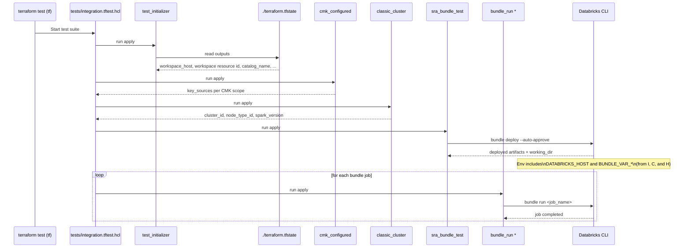

# Tests Overview

This directory holds the test files and the reusable Terraform modules they orchestrate, using Terraform's native testing
framework (`terraform test`). Tests are run from the parent `tf` directory, which is `terraform test`'s default test
directory.

For the suites, the commands to run them, and their prerequisites — in particular the private-link networking
requirement for the integration suite — see [Test suite](../../README.md#test-suite) in the top-level README. This file
documents the helper modules themselves.

At a high level, the integration suite will:
- Initialize context by reading the already-applied environment state (workspace host, catalog name, etc.).
- Confirm the workspace is configured for customer-managed keys on all three scopes.
- Provision a small, short‑lived classic cluster for running example workloads.
- Deploy Databricks Asset Bundle resources (jobs, notebooks, experiments, models) defined under `sra_bundle_test/bundle`.
- Execute those bundle jobs (Spark basic, ML workflows, Lakehouse connectivity) and optionally open their pages in a browser.

These tests validate that the deployed workspace can execute typical workflows end-to-end.

## Call stack



## Prerequisites

- Terraform 1.6+ (for `terraform test`).
- Databricks Terraform provider (downloaded automatically by Terraform).
- Databricks CLI v0.218+ (provides `databricks bundle ...`).
- Authentication to Databricks for both Terraform and the CLI:
  - Environment variables or profile for the provider and CLI (for example, `DATABRICKS_HOST`, `DATABRICKS_TOKEN`), or a supported cloud identity flow.
  - Note: If you have already configured your environment for `terraform apply`, `terraform test` should work exactly the same.
- An environment that has already been applied from the `tf` root, so that the local `terraform.tfstate` there contains the required outputs (for example, workspace host, workspace resource ID, catalog name).
- Network access to the workspace over private link — see the warning in the [top-level README](../../README.md#integration-tests).

## How the tests are orchestrated

`tests/integration.tftest.hcl` orchestrates the flow, passing variables and environment into the modules in this folder. Important patterns you will see in that file:

- A "test initializer" run to read outputs from the local state in the `tf` directory (`./terraform.tfstate`).
- Computation of an `environment` map that is provided to the Databricks CLI Bundles commands, including:
  - `DATABRICKS_HOST`
  - `BUNDLE_VAR_node_type_id`, `BUNDLE_VAR_spark_version`, `BUNDLE_VAR_catalog_name`, `BUNDLE_VAR_sra_tag`, `BUNDLE_VAR_cluster_id`
  - These become available to the bundle via `${var.*}` references in `databricks.yml` and job YAML files.
- Sequential runs that:
  1) deploy the bundle assets, and
  2) run individual bundle jobs like `spark_basic`, `ml_workflow_classic`, `ml_workflow_serverless`, followed by cleanup jobs.

## Modules in this directory

- `test_initializer/`
  - Reads the local Terraform state from the `tf` directory (path is resolved at test runtime) and exposes its outputs to the test. This provides values like workspace host and catalog name without duplicating data sources here.
  - Note that it reads outputs as they are *stored in state*, not as they are written in `outputs.tf`. Adding a new output means running `terraform apply` before a test can consume it, even though the apply changes no infrastructure.

- `cmk_configured/`
  - Reads the deployed workspace over ARM (`azapi`) and reports the CMK key source, vault URI, disk-key rotation setting, and infrastructure encryption flag.
  - Outputs: `key_sources`, `key_vault_uris`, `managed_disk_rotation_to_latest_enabled`, `infrastructure_encryption_enabled`.
  - Reaches `management.azure.com` rather than the workspace, so unlike the runs below it works from outside the VNet.

- `classic_cluster/`
  - Provisions a small autoscaling classic cluster suitable for test jobs.
  - Outputs: `cluster_id`, `node_type_id`, `spark_version`.
  - Uses provider authentication from the environment (for example, `DATABRICKS_HOST`/`DATABRICKS_TOKEN`).

- `sra_bundle_test/`
  - Deploys the bundle located at `sra_bundle_test/bundle` via `databricks bundle deploy --auto-approve` and destroys it on cleanup.
  - Exposes `working_dir` so downstream steps can run bundle jobs from the same folder.

- `bundle_run/`
  - Runs a specific bundle job via `databricks bundle run <job_name>`.
  - Variables:
    - `bundle_job_name` (string): logical job name from the bundle (not the workspace job name).
    - `working_dir` (string): directory containing `databricks.yml`.
    - `environment` (map): passed to the CLI process; must include `DATABRICKS_HOST` and any `BUNDLE_VAR_*` used by the bundle.
    - `open_test_job` (bool): if true, opens the job in a browser before running.

## Running the tests

The tests are executed from the `tf` root so that the relative paths and local state resolution work correctly.

```bash
cd tf
# Ensure your environment is applied and state has required outputs
terraform init
terraform apply

# Run the full test suite (mock plan tests plus integration tests)
terraform test

# Or just the integration suite
terraform test -filter=tests/integration.tftest.hcl
```

Notes:
- `terraform test` handles module init automatically for each run block. You do not need to run `terraform init` inside the helper modules in this directory.
- The `.tftest.hcl` files may set `open_test_job = false` by default; set it to `true` to open jobs in your web browser while they run.

## What gets validated

- All three CMK scopes are backed by a customer-managed key in the spoke vault, not the platform-managed key.
- Bundle deploys successfully and jobs can run using values injected via `BUNDLE_VAR_*`.
- A small classic cluster can be created and used by the jobs.
- Basic Spark functionality runs, ML workflow executes (including UC model registry and reading/writing to UC tables), and Lakebase connectivity is reachable.

## Troubleshooting

- Missing or invalid `DATABRICKS_TOKEN`/`DATABRICKS_HOST`:
  - The provider or the CLI will fail to authenticate. Export env vars or configure your Databricks profile.
- No required outputs in local state:
  - Ensure you have applied the `tf` root and that the state includes outputs such as workspace host and catalog name.
- `Invalid index ... The given key does not identify an element in this collection value` on a `test_initializer` output:
  - The output exists in `outputs.tf` but not yet in state. Run `terraform apply` to persist it, then re-run the test.
- Databricks command not found:
  - Install/upgrade the Databricks CLI to a version that supports bundles and ensure it’s on your `PATH`.
- The suite hangs on `bundle_deploy` with no output:
  - Almost always DNS rather than slowness. The workspace hostname is resolving to its public IP, which front-end Private Link rejects. See the private-link warning in the [top-level README](../../README.md#integration-tests).
- `Error acquiring the state lock`:
  - An `apply`, `destroy`, or another `test` is in flight against the same state. Wait for it to finish rather than forcing the lock.
